# Quiz App System Flow Diagram

## Table of Contents
1. [System Overview](#system-overview)
2. [Architecture Components](#architecture-components)
3. [User Authentication Flow](#user-authentication-flow)
4. [Main Application Flow](#main-application-flow)
5. [Quiz Taking Flow](#quiz-taking-flow)
6. [Progress & Difficulty System](#progress--difficulty-system)
7. [Data Flow Architecture](#data-flow-architecture)
8. [Firebase Integration](#firebase-integration)
9. [Session Management](#session-management)
10. [Component Interaction Diagram](#component-interaction-diagram)

---

## System Overview

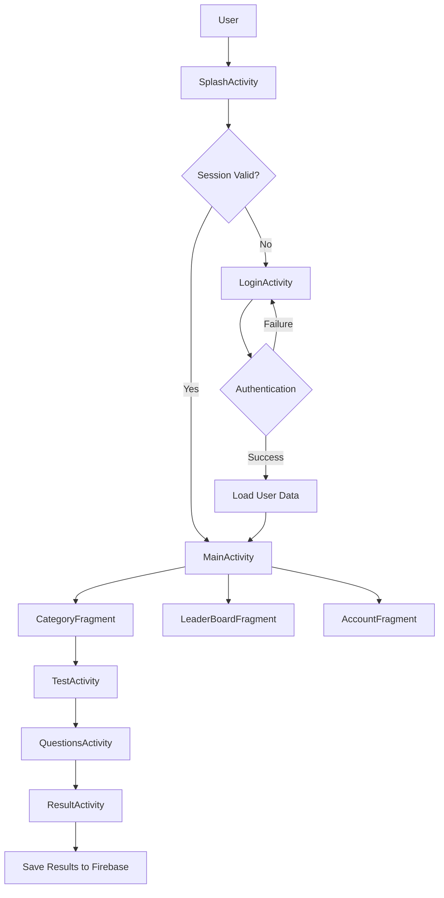

---

## Architecture Components

### Core Activities
```
┌─────────────────┐    ┌─────────────────┐    ┌─────────────────┐
│  SplashActivity │───▶│  LoginActivity  │───▶│  MainActivity   │
│                 │    │                 │    │                 │
│ • App Init      │    │ • Email/Pass    │    │ • Navigation    │
│ • Session Check │    │ • Google Auth   │    │ • Fragment Host │
│ • Auto Login    │    │ • User Creation │    │ • Drawer Menu   │
└─────────────────┘    └─────────────────┘    └─────────────────┘
                                                       │
                       ┌─────────────────┐    ┌─────────────────┐
                       │  TestActivity   │◀───│ CategoryFragment│
                       │                 │    │                 │
                       │ • Test List     │    │ • Category Grid │
                       │ • Unlock Status │    │ • Progress Stats│
                       │ • Difficulty    │    │ • Sample Data   │
                       └─────────────────┘    └─────────────────┘
                               │
                       ┌─────────────────┐    ┌─────────────────┐
                       │QuestionsActivity│───▶│ ResultActivity  │
                       │                 │    │                 │
                       │ • Quiz Interface│    │ • Score Display │
                       │ • Timer System  │    │ • Progress Save │
                       │ • Navigation    │    │ • Firebase Sync │
                       └─────────────────┘    └─────────────────┘
```

### Core Fragments
```
MainActivity
├── CategoryFragment (Home)
│   ├── CategoryAdapter
│   ├── CategoryModel
│   └── Grid Layout (2 columns)
├── LeaderBoardFragment
│   ├── LeaderboardAdapter
│   └── RankModel
└── AccountFragment
    ├── ProfileModel
    └── User Settings
```

### Core Systems
```
┌─────────────────┐    ┌─────────────────┐    ┌─────────────────┐
│ SessionManager  │    │UserProgressMgr  │    │    DbQuery      │
│                 │    │                 │    │                 │
│ • Login State   │    │ • Test Unlocks  │    │ • Firebase Ops  │
│ • 24hr Timeout  │    │ • Difficulty    │    │ • Data Loading  │
│ • Auto Refresh  │    │ • Progress Track│    │ • CRUD Ops      │
│ • Session Logs  │    │ • Score Calc    │    │ • Error Handle  │
└─────────────────┘    └─────────────────┘    └─────────────────┘
```

---

## User Authentication Flow

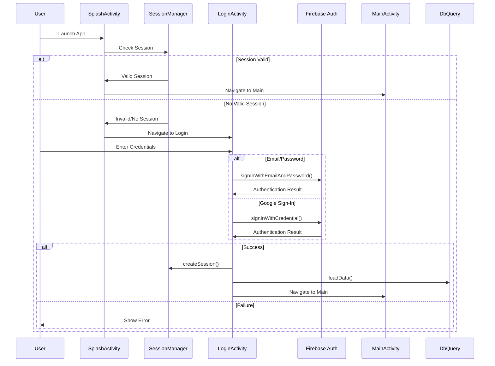

---

## Main Application Flow

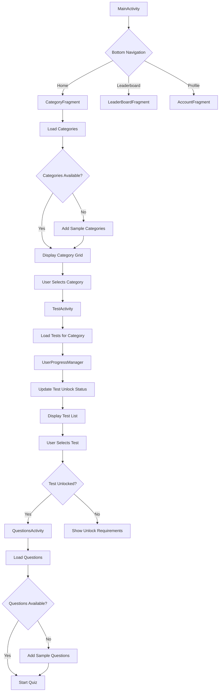

---

## Quiz Taking Flow

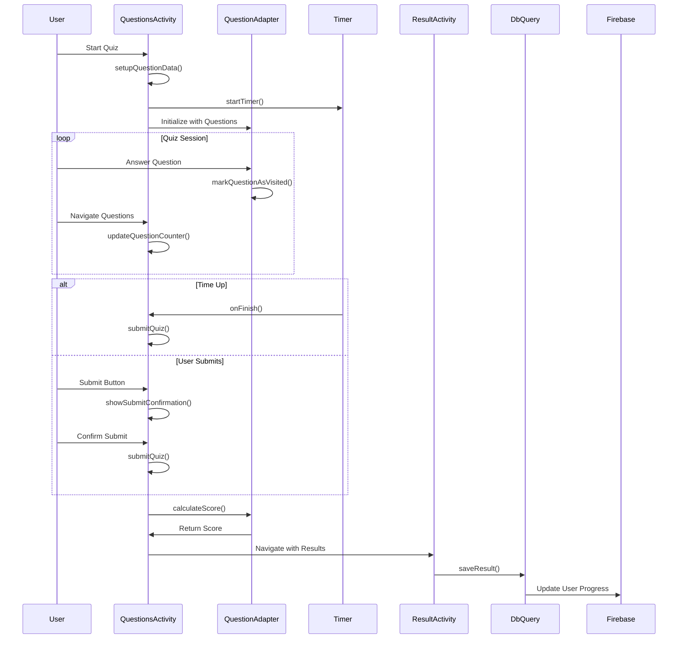

---

## Progress & Difficulty System

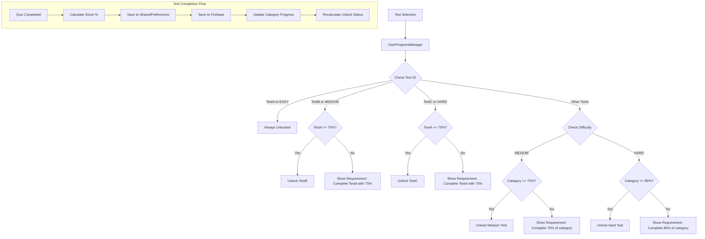

### Difficulty Level Rules
```
EASY Tests (1-3):
├── Always unlocked
├── No prerequisites
└── Entry point for users

MEDIUM Tests (4-6):
├── Unlock at 70% category completion
├── OR TestA completed with 75%+ (for TestB)
└── Intermediate difficulty

HARD Tests (7+):
├── Unlock at 85% category completion
├── OR TestA completed with 75%+ (for TestC)
└── Advanced difficulty
```

---

## Data Flow Architecture

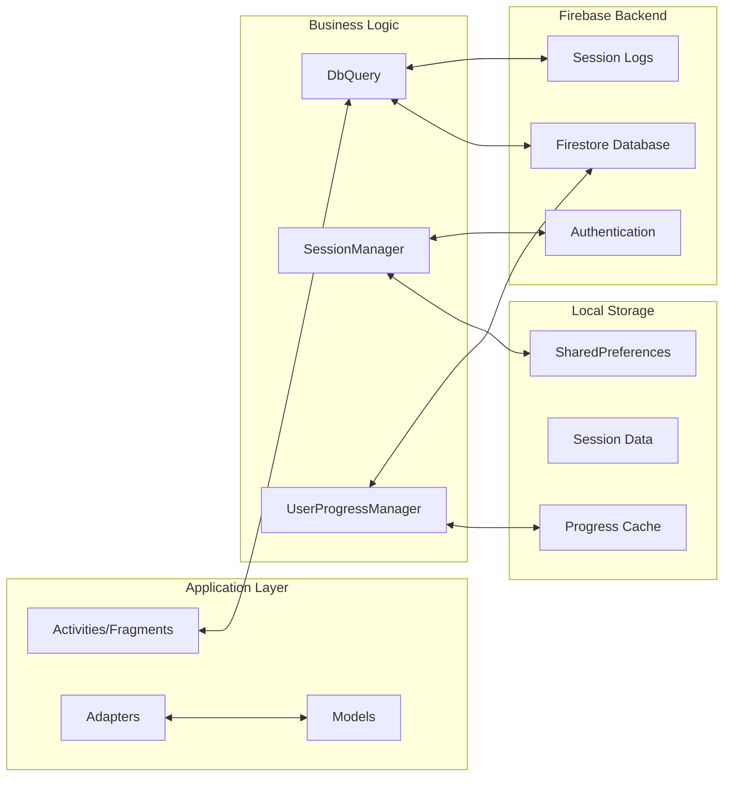

### Database Structure
```
Firestore Collections:
├── USERS/{userId}
│   ├── NAME: String
│   ├── EMAIL_ID: String
│   ├── TOTAL_SCORE: Number
│   └── PROGRESS/{categoryId}
│       ├── CATEGORY_ID: String
│       ├── OVERALL_COMPLETION: Number
│       ├── TOTAL_TESTS: Number
│       └── TEST_{testId}: Object
│           ├── SCORE: Number
│           ├── MAX_SCORE: Number
│           ├── PERCENTAGE: Number
│           └── COMPLETED_AT: Timestamp
├── QUIZ/{categoryId}
│   ├── NAME: String
│   ├── NO_OF_TESTS: Number
│   └── TESTS_LIST/TESTS_INFO
│       ├── TEST1_ID: String
│       ├── TEST1_TIME: Number
│       ├── TEST1_DIFFICULTY: String
│       ├── TEST1_REQUIRED_SCORE: Number
│       └── ... (repeat for each test)
├── Questions/{questionId}
│   ├── CATEGORY: String
│   ├── TEST: String
│   ├── QUESTION: String
│   ├── A, B, C, D: String (options)
│   └── ANSWER: Number (correct option index)
└── SESSION_LOGS/{logId}
    ├── userId: String
    ├── sessionId: String
    ├── event: String
    ├── timestamp: Number
    └── duration: Number
```

---

## Firebase Integration

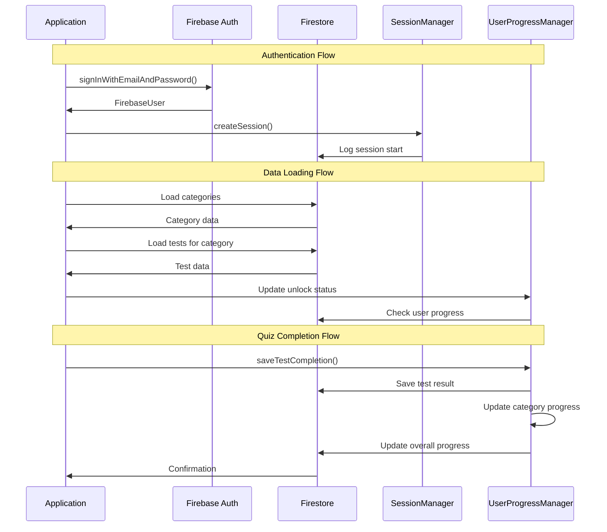

### Firebase Operations
```
DbQuery Class Methods:
├── Authentication
│   ├── createUserData()
│   └── getUserData()
├── Categories
│   └── loadCategories()
├── Tests
│   └── loadTests()
├── Questions
│   └── loadquestions()
├── Results
│   └── saveResult()
└── Utilities
    └── debugDatabaseStructure()
```

---

## Session Management

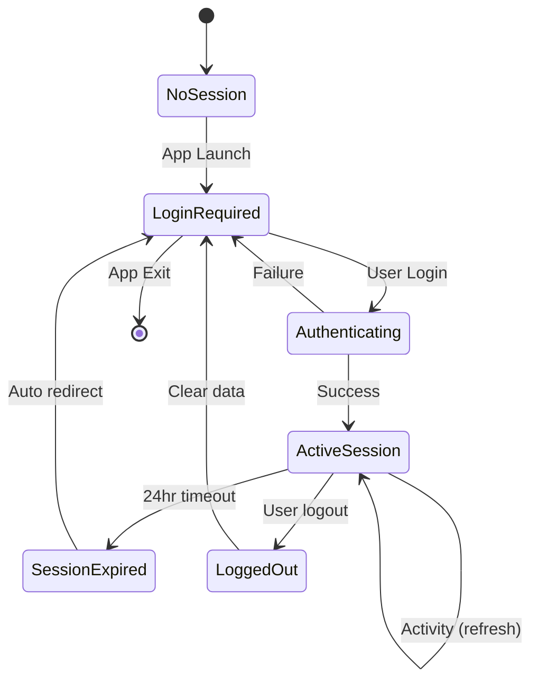

### Session Features
```
SessionManager Capabilities:
├── Session Creation
│   ├── Generate unique session ID
│   ├── Store user credentials
│   └── Log to Firebase
├── Session Validation
│   ├── 24-hour timeout
│   ├── Auto-refresh on activity
│   └── Firebase sync
├── Session Termination
│   ├── Manual logout
│   ├── Auto-expiry
│   └── Data cleanup
└── Session Analytics
    ├── Duration tracking
    ├── Activity logs
    └── Usage statistics
```

---

## Component Interaction Diagram

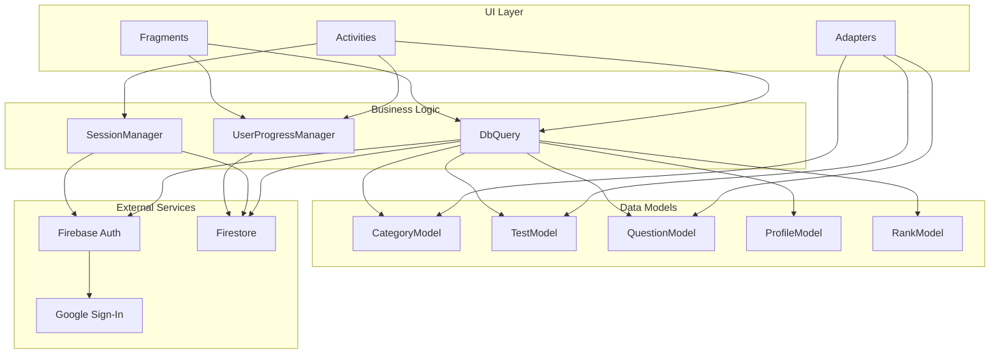

### Key Interactions
```
MainActivity ←→ SessionManager: Session validation
CategoryFragment ←→ DbQuery: Load categories
TestActivity ←→ UserProgressManager: Check unlock status
QuestionsActivity ←→ DbQuery: Load questions
ResultActivity ←→ DbQuery: Save results
All Components ←→ Firebase: Data persistence
```

---

## Error Handling & Edge Cases

### Error Handling Strategy
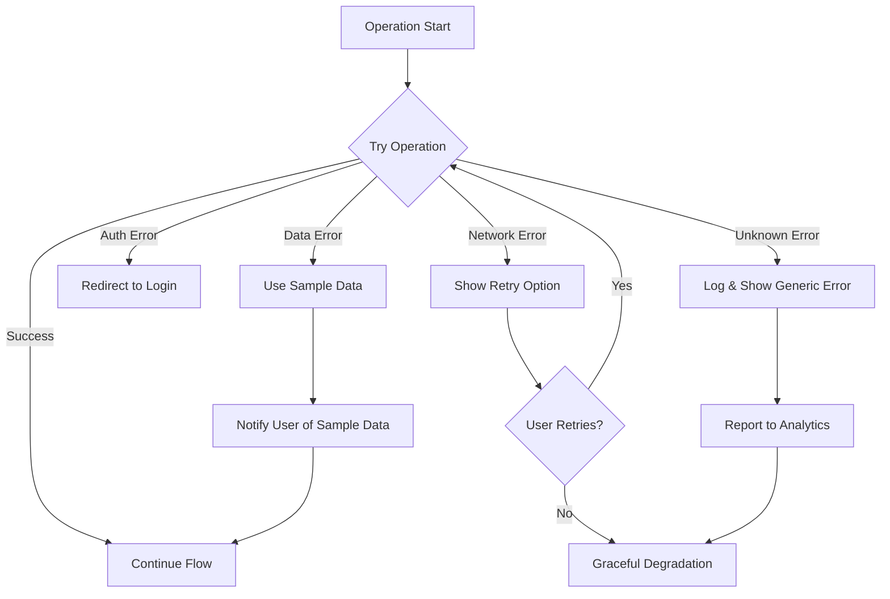

### Edge Cases Handled
```
Authentication:
├── No internet connection
├── Invalid credentials
├── Google Sign-In failure
└── Session expiry during use

Data Loading:
├── Empty database collections
├── Malformed data structures
├── Missing required fields
└── Network timeouts

Quiz Taking:
├── No questions available
├── Timer synchronization
├── App backgrounding
└── Unexpected exits

Progress Tracking:
├── Concurrent quiz attempts
├── Data sync conflicts
├── Offline mode handling
└── Progress corruption
```

---

## Performance Considerations

### Optimization Strategies
```
Data Loading:
├── Lazy loading of questions
├── Category caching
├── Progress caching in SharedPreferences
└── Batch Firebase operations

UI Performance:
├── RecyclerView optimization
├── Image loading optimization
├── Fragment lifecycle management
└── Memory leak prevention

Network Optimization:
├── Offline capability
├── Request batching
├── Connection pooling
└── Retry mechanisms
```

---

## Security Implementation

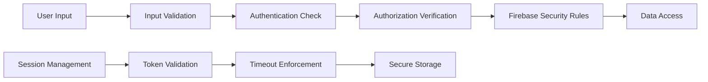

### Security Features
```
Authentication Security:
├── Firebase Authentication
├── Google OAuth integration
├── Session timeout (24 hours)
└── Secure token storage

Data Security:
├── Firestore security rules
├── User data isolation
├── Input validation
└── SQL injection prevention

Session Security:
├── Unique session IDs
├── Activity tracking
├── Auto-logout on timeout
└── Secure preferences storage
```

---

This system flow diagram provides a comprehensive overview of your Quiz App's architecture, showing how all components interact to create a seamless user experience with robust progress tracking and difficulty management systems.
